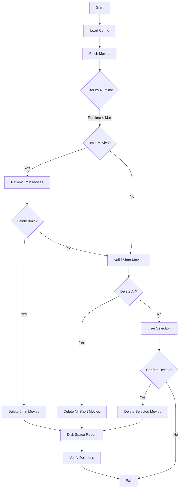

# Radarr Movie Cleanup Tool


A cross-platform CLI tool for managing Radarr movie library based on runtime criteria.

## Features
- Multi-OS support (Windows/macOS/Linux)
- Interactive confirmation before deletion
- Automated blocklist verification
- Disk space reclaim reporting
- Detailed audit logging

## 📚 OS-Specific Guides
Choose your operating system for detailed instructions:

- [Windows Installation Guide](WINDOWS_GUIDE.md)
- [macOS Installation Guide](MACOS_GUIDE.md)
- [Linux Installation Guide](LINUX_GUIDE.md)
- [Unraid Installation Guide](UNRAID_GUIDE.md)

### Core Requirements
- Python 3.8+
- `requests` package
- Radarr v4+ instance


## 📁 Configuration
Create `config.json`:
```json
{
  "radarr_ip": "localhost",
  "radarr_port": "7878",
  "radarr_api_key": "your_api_key"
}
```


## 🔄 Workflow


## ✔️ Verification Steps
1. Check Radarr web UI for removed movies
2. Inspect `radarr_cleanup.log`
3. Confirm free space increase
4. Verify blocklist entries

## 🐛 Common Troubleshooting
| Issue | First Steps |
|-------|-------------|
| Connection Errors | Verify Radarr is running<br>Check API key validity |
| Python Issues | Confirm Python version with `python --version` |
| Permission Denied | Run with elevated privileges if needed |
| Unraid Network Issues | Use host network mode for Radarr container |
| Radarr API Errors | Double-check API key and Radarr URL |
| Script Fails Silently | Check logs for errors or exceptions |

## 🤝 Contributing
1. Fork the repository
2. Create feature branch
3. Test across all platforms
4. Submit PR with documentation updates

## 📄 License
MIT License